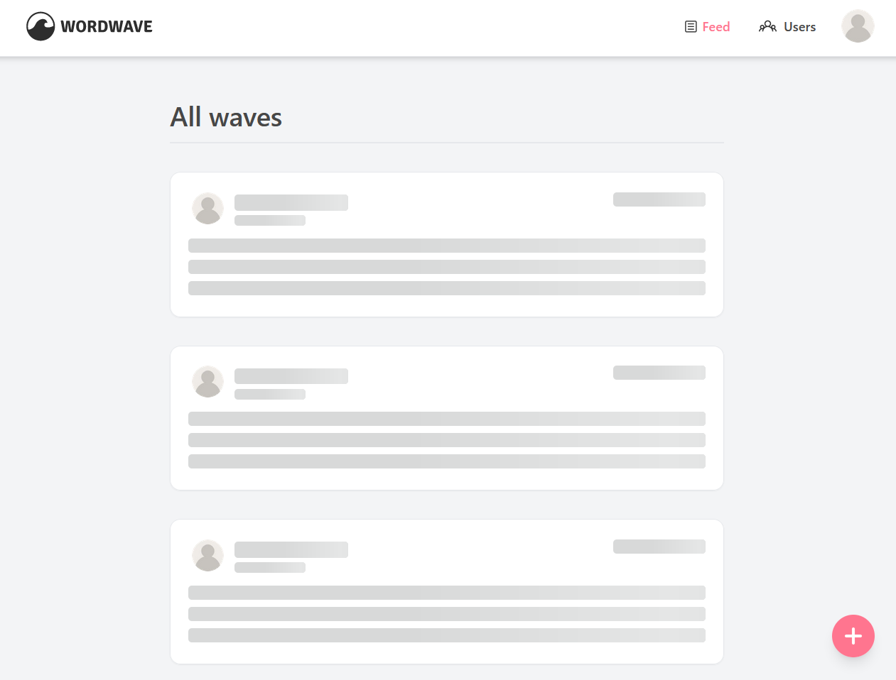

<h1 align="center">Wordwave 🌊</h1>
<p align="center">
<a href="https://makeapullrequest.com/" target="_blank"></a>
    <a href="/LICENSE" target="_blank">
    </a>
  <a href="https://twitter.com/shash0_0" target="_blank">
    
  </a>
</p>

<p align="center">The highly original 'Twitter clone'. This was supposed to be a take home assignment but here we are.</p>

## [Demo](https://word-wave-deployment.vercel.app/)



<p align="center">Eyebleach</p>

## Usage

#### Signed out 🔓

- Visit the site and scroll through waves
- View all users
- Sign in/ signup

#### Signed in 🔒

Create a new user account or use the following dummy credentials

```
username: cheems@doge.com
password: cheemsthedoge
```

Once signed in

- Get a personalized feed
- Create a new wave
- Follow users (unfollow coming soon)
- View your profile information
  - See the users you follow
  - See the users that follow you
  - See all waves that you've created
- Edit your profile
- Logout
- Star this repo

## Tech stack

- **[React](https://react.dev/)** - for composable spaghetti code
- **[Tailwindcss](https://tailwindcss.com/)** - for unreadable HTML
- **[Typescript](https://www.typescriptlang.org/)** - type safety at the cost of headache
- **[preline](https://preline.co/)** - taiwlind component library that likes to be a lil extra
- **[React hook form](https://react-hook-form.com/)** - form states, performance, errors
- **[Zod](https://zod.dev/)** - schema resolver, form validator
- **[Zustand](https://docs.pmnd.rs/zustand/getting-started/introduction)** - bearbones state management solution
- **[Firebase](https://firebase.google.com/)** - Backend for the site

#### Utilities

- **[Tailwind/forms](https://github.com/tailwindlabs/tailwindcss-forms)** - simple resets for your forms
- **[React loading skeleton](https://www.npmjs.com/package/react-loading-skeleton)** - walking skeletons
- **[React hot toast](https://react-hot-toast.com/docs)** - the only thing that makes react a little more bearable is its ecosystem
- **[Fakerjs](https://www.youtube.com/watch?v=R6S-b_k-ZKY&pp=ygUWVGhlIEludGVybmV0J3MgT3duIEJveQ%3D%3D)** - mock data generation
- **[Fecha](https://www.npmjs.com/package/fecha)** - Effortless date parsing
- **[Prettier](https://prettier.io/)** - opinionated formatting with a minimal .prettierrc config
- **[Vite(SWC)](https://vitejs.dev/guide/why.html)** - blazingly fast module bundler
- **[pnpm](https://pnpm.io/)** - performant npm. No false audit warnings

## Install

This project is built with

```
pnpm v8.12.0
node v20.7.0
vite: v5.0.8
```

1. If you want to install locally, fork and pull this repo, then run

```sh
pnpm install
   #or
npm install
```

2. Spin up the development server

```sh
pnpm dev
  #or
npm dev
```

## Continued development

- Introduction of more user actions
- Create wave: turn it into a WYSIWYG editor
- Enforcing tests
- Dark theme support

## Author

👤 **Shashwat Jaiswal**

- Website: [Link](okay-head.netlify.app)
- Twitter: [@shash0_0](https://twitter.com/shash0_0)

## Show your support

Give a ⭐️ if you liked this project!

## License

Copyright © 2024 [Shashwat Jaiswal](https://github.com/okay-head).<br />
This project is [MIT](/LICENSE) licensed.

## Acknowledgements

- Pretty SVG illustrations by [Katerina Limpitsouni](https://undraw.co/) (you are amazing!)
- Icons by [Icons8](https://icons8.com/)
- Icons by [Flaticon](https://www.flaticon.com/)
